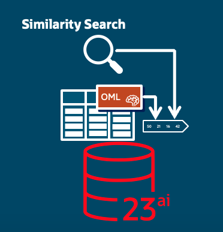

# Unlock Similarity Search on Relational Data, with the Oracle DB23ai.
<p align="center">
  
</p>

This lab is made on the paragraph "*Vectorize Relational Tables Using OML Feature Extraction Algorithms*" from the **Oracle® Database
Oracle AI Vector Search User's Guide** you can access [here](https://docs.oracle.com/en/database/oracle/oracle-database/23/vecse/vectorize-relational-tables-using-oml-feature-extraction-algorithms.html).

You find in this repo two main files:
- `bank_upload.ipynb` : a Jupyter Notebook to upload the dataset used in th AI Vector Search User Guide in a 23ai DB instance, using Python and OracleDB driver.
- `create_model.sql` : to use a Principal Component Analysis (PCA) algorithm to create a embedding vectors and make similarity search, in PL/SQL.

These source code allow you test the content of the related blog post:
**Unlock Similarity Search on Relational Data, with the Oracle DB23ai.**

That's a lot of talk about unstructured data, chunking and embedding on which apply similarity search for RAG too, but how to use this new features on traditional tabular data?
Let's suppose we need to search for medical records similar to a patient to apply the same treatment, or giving a financial status of a customer we want to see if a loan has been granted to others in similar condition in the past?
Let's discover how to simplify these types of search exploiting the Oracle Machine Learning algorithms like
Feature Extraction, running in the Oracle Database in conjunction with the VECTOR_EMBEDDING() operator to vectorize sets of relational data, build similarity indexes, and perform similarity searches on the resulting vectors.

NOTICE: *we are not going to use LLMs or Embeddings model that require GPUs to run, but the classical Oracle Machine Learning algorithms that run in an excellent manner in the Oracle DB.*

Feature Extraction algorithms help in extracting the most informative features/columns from the
data and aim to reduce the dimensionality of large data sets by identifying the principal
components that capture the most variance in the data. This reduction simplifies the data set
while retaining the most important information, making it easier to analyze correlations and
redundancies in the data.
The Principal Component Analysis (PCA) algorithm, a widely used dimensionality reduction
technique in machine learning, is used in this tutorial.
Making a similarity seach on the output of this algorithm, that is **Vector** type compatible from 23.7 with the VECTOR_EMBEDDING() operator, it's possible to retrieve the most similar records giving in input a same kind of record.
The index that you can create on the vectors makes it possible now, since a full scan distance calculation among a vector and all the vectors in the table wasn't impracticable in the past for performance reasons.

## Install DB23ai
- First of all we need to upload the dataset used in the guide in an Oracle DB 23ai instance. You can use an Oracle 23ai free container in docker in this way:
```bash
podman run -d --name db23ai -p 1521:1521 container-registry.oracle.com/database/free:latest
podman exec db23ai ./setPassword.sh Welcome1234##
```
- Then create an user to store tables, algorithms and vectors:
```bash
podman exec -it db23ai sqlplus '/ as sysdba'
```
- run in sqlplus:
```bash
alter system set vector_memory_size=512M scope=spfile;
alter session set container=FREEPDB1;

CREATE USER "VECTOR" IDENTIFIED BY vector
    DEFAULT TABLESPACE "USERS"
    TEMPORARY TABLESPACE "TEMP";
GRANT "DB_DEVELOPER_ROLE" TO "VECTOR";
ALTER USER "VECTOR" DEFAULT ROLE ALL;
ALTER USER "VECTOR" QUOTA UNLIMITED ON USERS;
EXIT;
```

- Restart the container and the db it's ready.

## Upload dataset

- Download from [here](https://archive.ics.uci.edu/dataset/222/bank+marketing) the dataset zip file. 
- Unzip the file and look for `bank-additional-full.csv` in the directory `bank+marketing/bank-additional`. 
- Copy that file in the Jupyter Notebook directory.
- Create a `venv` on which run the notebook:
```bash
cd src/
python3.11 -m venv .venv --copies
source .venv/bin/activate
pip3.11 install --upgrade pip wheel setuptools
```
  
## Create the model for PCA and generate vectors

- Prepare the table to store the settings related to the PCA model we are going to create:
```bash
CREATE TABLE mod_sett(
    setting_name VARCHAR2(30),
    setting_value VARCHAR2(30)
);
/
```

- Insert main settings related to the model:
```bash
BEGIN
    INSERT INTO mod_sett (setting_name, setting_value) VALUES
                ( dbms_data_mining.algo_name,
                  dbms_data_mining.algo_singular_value_decomp);
    INSERT INTO mod_sett (setting_name, setting_value) VALUES
                (dbms_data_mining.prep_auto, dbms_data_mining.prep_auto_on);
    INSERT INTO mod_sett (setting_name, setting_value) VALUES
                (dbms_data_mining.svds_scoring_mode,
                dbms_data_mining.svds_scoring_pca);
    INSERT INTO mod_sett (setting_name, setting_value) VALUES
                (dbms_data_mining.feat_num_features, 5);
    commit;
END;
/
```
where: 
  - algo_singular_value_decomp: it's the ml algorithm (Singular Value Decomposition (SVD)) we are going to use.
  - prep_auto_on: each fields will be automatically transformed in numbers to be ingested by the PCA. This important features included in OML let you save time in data preparation.
  - svds_scoring_pca: we are using the Singular Value Decomposition (SVD) algorithm for Principal Component Analysis (PCA).
  - 5: are the size of vector you want to reduce the initial 20 fields included in the dataset table.

- create the model:
```bash
BEGIN
    DBMS_DATA_MINING.CREATE_MODEL(
        model_name => 'pcamod',
        mining_function => dbms_data_mining.feature_extraction,
        data_table_name => 'bank',
        case_id_column_name => 'id',
        settings_table_name => 'mod_sett');
END;
/
```
It's quite intuitive the meaning of each parameters. `pcamod` it will be the reference to the model created we have to use for vectorization.


## Use the model for similarity search
- In this way:
```bash
CREATE TABLE pca_output AS
    (   SELECT id, vector_embedding(pcamod USING *) embedding
        FROM bank);
/
```
You create a new table with data coming from that storing the dataset loaded, adding a new field with the embedding vector created on each record with the PCA algorithms.
- To make feasible to exploit the embedding vectors, we create and IVF permanent index, with an accuracy of 95% to speedup the search:
```bash
  CREATE VECTOR INDEX my_ivf_idx ON pca_output(embedding)
ORGANIZATION NEIGHBOR PARTITIONS
DISTANCE COSINE WITH TARGET ACCURACY 95;
/
```

## Optional cleaning
If you want run more than one time the labs, remove the artifact created:
  
```bash
drop table pca_output CASCADE CONSTRAINTS;
/

drop table mod_sett CASCADE CONSTRAINTS;
/

BEGIN
    DBMS_DATA_MINING.DROP_MODEL(
        model_name => 'pcamod'
    );
END;
/
```

